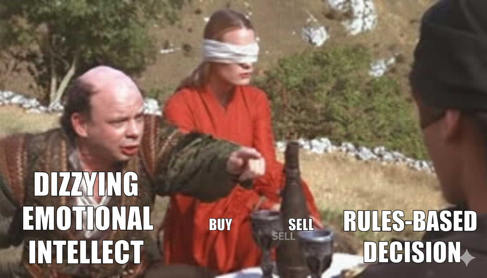
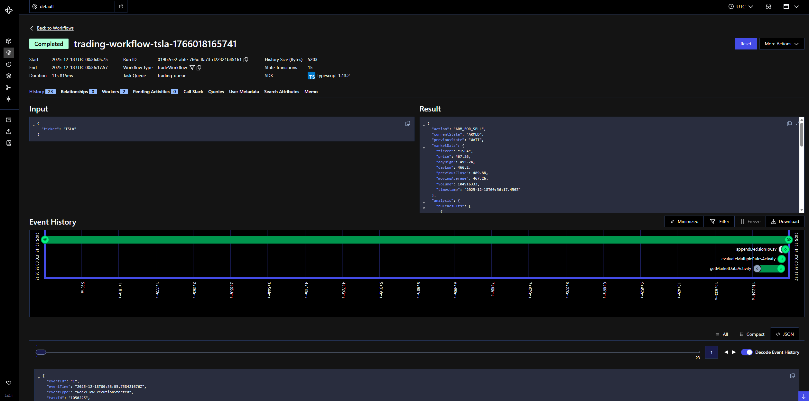

# How We Built an Emotion-Free Trading System with Temporal  
*And why workflows beat cron jobs for long-running decisions*

We all have a vested interest in the markets—whether it’s protecting ourselves from currency debasement or just building a nest egg. With equities near all-time highs, the question always looms: *are we going up or down next?*

Timing the market is impossible. What *is* predictable is human behavior: we sell when fear peaks and buy when hype is loudest. Logic loses, emotion wins—and usually at the worst possible time.



The fix isn’t better intuition.  
It’s **systems that make decisions consistently, over time, without losing state or context**.

That turns out to be less of a trading problem—and more of a **workflow problem**.

---

## The Real Problem Isn’t Trading Logic

Trading rules are easy.

You can write rules like:
- “Buy when price crosses above the 50-day moving average”
- “Sell when volume spikes during a downtrend”

What’s hard is everything *around* those rules:

- Decisions span **days, weeks, or months**
- Failures happen **at the worst possible times**
- State must survive crashes and deploys
- Every decision must be **auditable**

Most systems try to glue this together with:
- Cron jobs  
- Queues  
- Databases  
- Ad-hoc retry logic  

Eventually, something drifts out of sync.

This isn’t a compute problem.  
It’s a **coordination problem**.

---

## Why Temporal Exists

Temporal is built for one thing:

> **Durable execution of business logic over time.**

A Temporal workflow is:
- A long-running state machine
- That remembers where it left off
- And keeps going—even when your workers crash

For trading systems, that means:
- Decisions don’t reset on restarts
- Time delays are reliable
- Retries are safe and deterministic
- Execution history becomes an audit log

Before getting fancy, let’s start with the smallest possible version.

---

## The Simplest Possible Trading Workflow

Conceptually, our trading loop looks like this:

```ts
while (true) {
  const marketData = await getMarketData()
  const decision = await evaluateRule(marketData)

  if (decision === 'BUY') {
    await notify()
    break
  }

  await sleep('1 day')
}
```
If you run this in a normal service:
- The loop dies on restart
- `sleep` doesn’t survive crashes
- Retries risk double-executing logic

In **Temporal**:
- That loop can run for months
- Sleeps survive restarts
- State is persisted automatically
- The entire execution is replayable

This is the moment most engineers “get” workflows.

---

## Why Workflows Beat Cron Jobs (Every Time)

You *can* build this without Temporal—but you’ll end up rebuilding Temporal badly.

| Traditional Stack | Temporal |
|------------------|----------|
| Cron jobs | Durable timers |
| Queues | Stateful workflows |
| Manual retries | Automatic, replay-safe retries |
| Logs | Full execution history |

Temporal lets you write business logic the way it actually runs:

> **Over time, with failures, and without losing state.**

---

## Scaling the Idea: From One Rule to Many

Once the workflow exists, complexity becomes manageable instead of fragile.

We expanded the system to evaluate multiple independent rules:
- Price action (moving averages)
- Volume analysis
- Momentum detection
- Trend confirmation

Each rule:
- Runs independently
- Produces a signal
- Contributes to a weighted decision

The important insight:

> **The workflow doesn’t get smarter—it just coordinates more work.**

Rules live in activities.  
The workflow remains readable and deterministic.

---

## Activities: Where the Real World Lives

Temporal enforces a clean separation:

- **Workflows orchestrate**
- **Activities execute**

Anything non-deterministic—API calls, calculations, I/O—lives in activities.

```ts
export async function getMarketDataActivity(ticker: string) {
  return yahooFinance.fetch(ticker)
}
```

Why this matters:
- Activities retry independently
- API failures don’t corrupt workflow state
- Workflow code stays replay-safe forever

This separation is the foundation of Temporal’s reliability.

---

## Failure Is the Default Case

Markets don’t wait for your infrastructure.

So we designed for failure:
- Yahoo Finance rate limits
- Network hiccups
- Worker crashes mid-decision

With Temporal:
- Activities retry automatically
- Workflows resume exactly where they left off
- No duplicated decisions
- No lost context

Failure becomes expected—and boring.

That’s exactly what you want.

---

## Observability *Is* Auditability

Every workflow execution has:
- A complete, queryable history
- Every decision and retry
- All inputs and outputs

That history *is* your audit log.

We export decisions to CSV for convenience, but the **Temporal execution history is the source of truth**.



For financial systems—or any system that needs explainability—that’s a massive advantage.

---


## When You Should Reach for Temporal

If your system:
- Waits on time
- Retries on failure
- Needs to remember state
- Must be observable and auditable

You probably want workflows.

That applies to:
- Trading systems
- Risk checks
- Approval pipelines
- Alerting engines
- Portfolio rebalancing

---

## The Takeaway

Temporal doesn’t just make systems more reliable.

It changes how you *think* about them.

> **You stop writing code that hopes it finishes—and start writing code that’s guaranteed to.**

That’s the difference between cron jobs and workflows.

---

## Getting Started

The full example is available on GitHub  https://github.com/hananiel/trading-system and includes:
- Temporal workflows in TypeScript
- Market data and rule activities
- Multi-rule consensus logic
- Docker Compose setup
- Tests and demos

Run it locally. Kill the worker. Restart it.

Watch the workflow keep going.

That’s the point.
